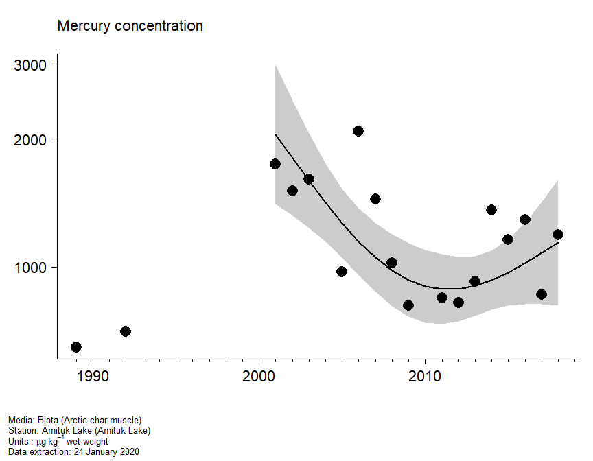
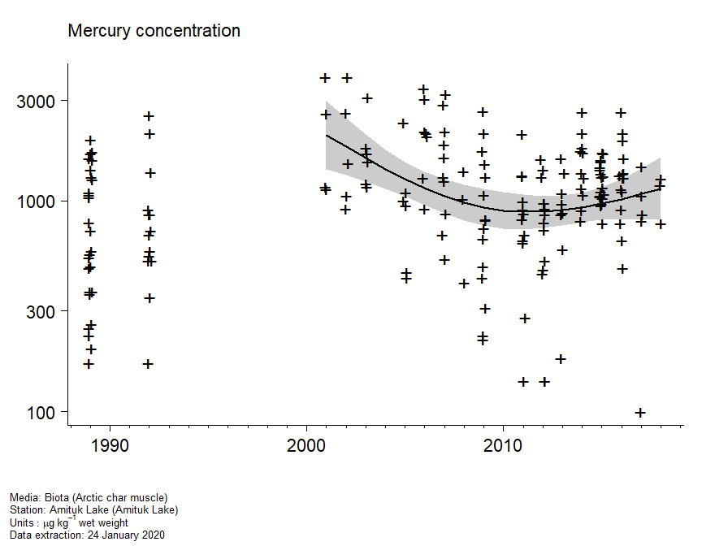
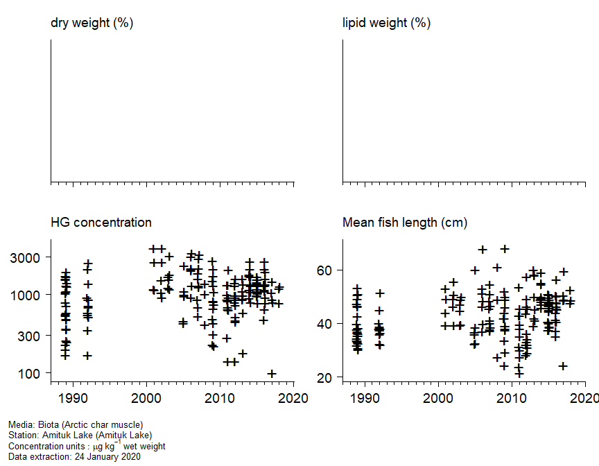
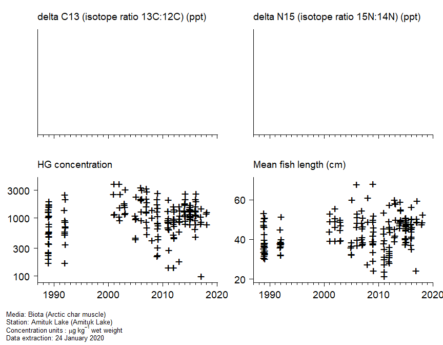

AMAP Hazardous substances Assessment Tool
================

As an example this markdown document has been produced using the code in
the 2020 folder. In practice, an HTML document will be produced, and
will be available via the link below:

<https://ocean.ices.dk/AHAT/Home/GettrResult?seriesID=Canada%20Amituk%20Lake%20HG%20Salvelinus%20alpinus%20MU&matrix=Biota&year=2020>

The graphical map interface to all assessments will be found here:
<https://ocean.ices.dk/ahat/>

### Assessment plots and statistical analysis

This report provides details of the assessment of mercury concentrations
in arctic char at station Amituk Lake.

<ul>

<li class="gap">

Timeseries metadata. Key information about the timeseries.

</li>

<li class="gap">

Assessment plot. The fitted trend (solid line) with pointwise 90%
confidence bands (grey shaded areas). The trend is plotted on the log
scale, with the axis labels back-transformed for ease of interpretation.
The points are the annual medians of the individual log concentration
measurements.

</li>

<li class="gap">

Trend with data. The fitted trend with pointwise 90% confidence bands.
The points are the individual concentration measurements, with d or q
denoting values below the limit of detection or quantification and \<
denoting other less-than values.

</li>

<li class="gap">

Auxiliary data. The individual concentration measurements with
supporting information: mean length of the individuals in the sample;
dry weight (%) of the sample; lipid weight (%) of the sample.

</li>

<li class="gap">

Stable isotope data. The individual concentration measurements with
supporting information: the mean length of the individuals in the
sample; the isotope ratio 13C:12C and the isotope ratio 15N:14N.

</li>

<!-- <li class = "gap">Assessment (related compounds).  Assessment plots for all the compounds in the same chemical group.</li> -->

<!-- <li class = "gap">Data (related compounds). A scatter plot matrix of the individual concentration measurements for all the compounds in the same chemical group.</li> -->

<li class="gap">

Statistical analysis. This tab summarises the fits of models with
different amount of smoothing. The final choice is the model with the
minimum AICc (with the caveat that a linear model is always preferred to
a mean model if there are sufficient years of data). The tab also gives
the contrast between the fitted values at the start and end of the
timeseries, and over the most recent twenty years.

</li>

</ul>

<br>

#### Timeseries metadata

<br>

<ul>

<li>

OSPAR region: 0

</li>

<li>

Region: East AMAP area

</li>

<li>

Station code: Amituk Lake

</li>

<li>

Station name: Amituk Lake

</li>

<li>

Station latitude: 75.05

</li>

<li class="gap">

Station longitude: -93.75

</li>

<li>

Media: biota

</li>

<li>

Species latin name: Salvelinus alpinus

</li>

<li>

Species common name: arctic char

</li>

<li>

Matrix: muscle

</li>

<li class="gap">

Group: not grouped

</li>

<li>

Determinand code: HG

</li>

<li>

Determinand name: mercury

</li>

<li class="gap">

Units: μg kg<sup>-1</sup> wet weight

</li>

<li>

Extraction: 24 January 2020

</li>

</ul>

<br>

#### Assessment plot

<!-- -->

#### Trend with data

<!-- -->

#### Auxiliary data

<!-- -->

#### Stable isotope data

<!-- -->

<!-- #### Assessments (related compounds) -->

<!-- ```{r, include = FALSE} -->

<!-- ok <- ! info$detGroup %in% "Imposex" -->

<!-- ``` -->

<!-- ```{asis, eval = !ok} -->

<!-- <br>  -->

<!-- No related responses assessed. -->

<!-- ``` -->

<!-- ```{r multi_assessment, eval = ok, echo = FALSE, message = FALSE, warning = FALSE, fig.width = 9, fig.height = 7} -->

<!-- plot.multiassessment( -->

<!--   assessment_object$data, assessment_object$assessment, info_multi, type = "assessment") -->

<!-- ``` -->

<!-- #### Data (related compounds) -->

<!-- ```{r, include = FALSE} -->

<!-- ok <- ! info$detGroup %in% "Imposex" -->

<!-- ``` -->

<!-- ```{asis, eval = !ok} -->

<!-- <br>  -->

<!-- No related responses assessed. -->

<!-- ``` -->

<!-- ```{r multi_data, eval = ok, echo = FALSE, message = FALSE, warning = FALSE, fig.width = 9, fig.height = 7} -->

<!-- plot.multidata(assessment_object$data, info_multi) -->

<!-- ``` -->

#### Statistical analysis

<br>

**Trend assessment**

Analysis of variance

``` 
                Df      AIC     AICc   Log lik Deviance     Chisq Chi df Pr(>Chisq)
mean             1 281.0606 282.4452 -137.5303 275.0606        NA     NA         NA
linear           2 278.9791 281.6457 -135.4895 270.9791 4.0814868      1 0.04335549
smooth (df = 2)  3 276.8192 281.3647 -133.4096 266.8192 4.1598438      1 0.04139322
smooth (df = 3)  4 278.7786 285.9786 -133.3893 266.7786 0.0406216      1 0.84027009
smooth (df = 4)  5 275.4483 286.3372 -130.7242 261.4483 5.3302900      1 0.02095790
```

<br>

Change in log concentration

``` 
              Year start Year end Fit start  Fit end     Change Std error        t   Pr(>|t|)
overall             2001     2018  7.625583 7.040567 -0.5850157 0.2487036 -2.35226 0.03507797
last 20 years       2001     2018  7.625583 7.040567 -0.5850157 0.2487036 -2.35226 0.03507797
```

<br>

**Interpretation**

There is a significant temporal trend in the time series (p = 0.0041).
The trend is nonlinear (p = 0.0414) so the shape of the trend must be
assessed visually. Concentrations at the end of the time series were
signficantly lower than those at the start of the time series (p =
0.0351) by an estimated 44.3%.

The lowest detectable annual increase in the time series (two-sided
test, power = 80%, size = 5%) is 4%. Had every year been sampled (so
there were no gaps in the time series), the lowest detectable annual
increase would have been 3.8%. The lowest detectable annual increase
with 10 years of annual monitoring is 10.2%. The lowest detectable
annual decrease with 10 years of annual monitoring is 9.3%.

Given the variability in the data, 16 years of annual monitoring would
be required to detect an annual increase of 5% with 80% power (two-sided
test, size = 5%).

The power of the time series to detect an annual increase of 5% is 94%
(two-sided test, size = 5%). Had every year been sampled, the power
would have been 95%. With 10 years of annual monitoring, the power would
be 29%.

<br/>

<!-- **Status assessment** -->

<!-- ```{r, eval = status_ok & info$detGroup != "Imposex", child = "assessment platform status.Rmd"} -->

<!-- ``` -->

<!-- ```{r, eval = status_ok & info$detGroup == "Imposex", child = "assessment platform status imposex.Rmd"} -->

<!-- ``` -->

### how to build this file

this file was created using (requires access to
`assessment_platform.RData`)

``` r
rmarkdown::render("README.Rmd")
```
